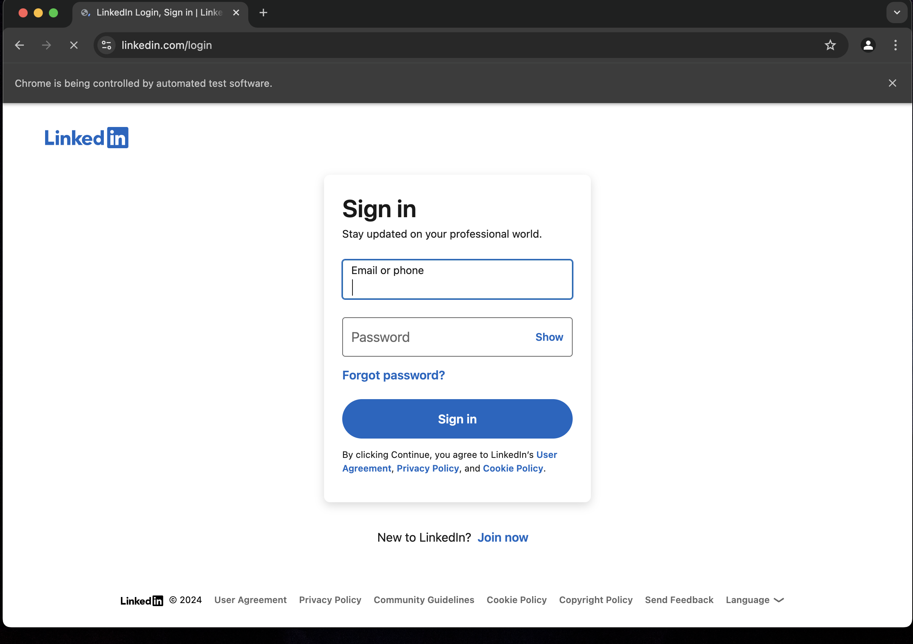
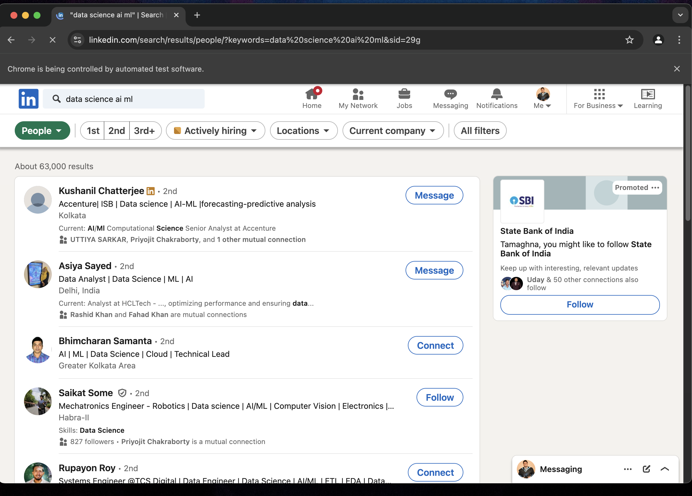

## LinkedIn Bot with Selenium Automation

### Project Overview
This project automates LinkedIn searches and attempts to connect with relevant individuals based on their profiles. It is implemented using **Python** and **Selenium WebDriver**, and the bot automatically logs into LinkedIn, searches for people with specific keywords in their profile (e.g., "Data Science", "AI", "Machine Learning"), and attempts to connect with them.

### Features:
1. **Automated Login**: The bot logs into LinkedIn using credentials provided in the script.
2. **Search for Profiles**: It searches LinkedIn for profiles with the specified keywords like "Data Science", "AI", and "Machine Learning."
3. **Display Profiles**: The bot retrieves relevant profiles and can display the list of profiles found in the search.
4. **Auto-Connect (attempted)**: The bot attempts to auto-connect with people found in the search results. Though this feature requires manual intervention due to limitations, it's set up to find "Connect" buttons and click on them.
5. **Scheduled Execution**: The bot is scheduled to run every day at **10 PM** automatically using **cron jobs**.

---

### Technologies Used:
- **Python 3.9+**: The main programming language for the script.
- **Selenium WebDriver**: To automate browser actions.
- **ChromeDriver**: To control the Chrome browser.
- **Crontab**: For scheduling the bot to run automatically every day.

---

### Libraries and Dependencies:
1. **Selenium**:
   ```bash
   pip install selenium
   ```
   Used to automate the browser and interact with web elements on LinkedIn.

2. **ChromeDriver**:  
   - Download from [ChromeDriver](https://sites.google.com/chromium.org/driver/).
   - Move `chromedriver` to `/usr/local/bin` for global access.

3. **Crontab (for scheduling)**:  
   Set up a cron job to run the script at 10 PM daily using the `crontab` command on Unix-based systems.

---

### Setup Instructions

#### Step 1: Clone the Repository
Clone the project from GitHub to your local system:

```bash
git clone https://github.com/your-username/LinkedIn_Bot.git
cd LinkedIn_Bot
```

#### Step 2: Install Dependencies
Install the required Python libraries:

```bash
pip install selenium
```

#### Step 3: Set Up ChromeDriver
1. Download the correct version of ChromeDriver for your system from the [ChromeDriver site](https://sites.google.com/chromium.org/driver/).
2. Move the `chromedriver` binary to `/usr/local/bin/`:

   ```bash
   sudo mv /path/to/chromedriver /usr/local/bin/
   sudo chmod +x /usr/local/bin/chromedriver
   ```

#### Step 4: Add Your LinkedIn Credentials
In the `exe.py` file, add your LinkedIn login credentials:

```python
# Enter your LinkedIn login credentials
username.send_keys("your-email@gmail.com")
password.send_keys("your-password")
```

**Note**: Ensure that you handle your credentials securely in a real project, possibly using environment variables or other safe methods.

#### Step 5: Run the Script
Run the script to log in and search for profiles:

```bash
python3 exe.py
```

#### Step 6: Automate the Bot to Run at 10 PM Daily (Optional)
To schedule the bot to run at 10 PM daily using a cron job:
1. Open your terminal and run:
   
   ```bash
   crontab -e
   ```

2. Add the following line to schedule the script to run every day at 10 PM:

   ```bash
   0 22 * * * /path/to/run_linkedin_bot.sh
   ```

3. Create the `run_linkedin_bot.sh` script to run the bot:

   ```bash
   #!/bin/bash
   source /Users/user/opt/anaconda3/bin/activate base
   cd /Users/user/Documents/Code/LinkedIn_Bot
   python3 exe.py
   ```

Make sure the script is executable:

```bash
chmod +x run_linkedin_bot.sh
```

---

### The Python Code Explanation

#### `exe.py`
This file contains all the code for the LinkedIn bot. Below is a breakdown of the functionality:

1. **Login to LinkedIn**:
   ```python
   from selenium import webdriver
   from selenium.webdriver.common.by import By
   from selenium.webdriver.common.keys import Keys
   import time

   def login_to_linkedin():
       service = Service("/usr/local/bin/chromedriver")
       driver = webdriver.Chrome(service=service)

       driver.get('https://www.linkedin.com/login')

       username = driver.find_element(By.NAME, 'session_key')
       password = driver.find_element(By.NAME, 'session_password')

       username.send_keys("your-email@gmail.com")
       password.send_keys("your-password")
       password.send_keys(Keys.RETURN)

       time.sleep(5)
       return driver
   ```

2. **Search for Profiles**:
   After logging in, the bot searches for people based on the provided keywords:
   ```python
   def search_for_profiles(driver):
       search_query = "https://www.linkedin.com/search/results/people/?keywords=data%20science%20ai%20ml"
       driver.get(search_query)
       time.sleep(5)
   ```

3. **Find and Click Connect Buttons**:
   The bot attempts to auto-connect with the found profiles by locating and clicking the "Connect" button:
   ```python
   def send_connection_requests(driver):
       connect_buttons = driver.find_elements(By.XPATH, "//button[.//span[contains(text(), 'Connect')]]")
       for button in connect_buttons[:20]:  # Limit to the first 20
           driver.execute_script("arguments[0].scrollIntoView(true);", button)
           time.sleep(1)
           button.click()
           time.sleep(2)
           try:
               send_button = driver.find_element(By.XPATH, "//button[contains(text(), 'Send')]")
               send_button.click()
           except:
               pass
   ```

4. **Main Script**:
   This combines all the functions:
   ```python
   if __name__ == "__main__":
       driver = login_to_linkedin()
       search_for_profiles(driver)
       send_connection_requests(driver)
       input("Press Enter to close the browser...")
       driver.quit()
   ```

---

### Challenges Encountered

1. **Auto-Connect**: LinkedIn's dynamic structure sometimes makes auto-connect unreliable. The bot is set to attempt connecting, but some manual intervention may be required.
2. **Scheduling**: The project is automated using cron jobs to run every day at 10 PM.
3. **XPath Tweaking**: Some elements required tweaking of XPaths for the bot to reliably find and interact with them.

---

### Future Improvements

1. **Handle Captchas**: Implement captcha-solving mechanisms or introduce breaks to reduce the chance of LinkedIn triggering captcha challenges.
2. **Error Handling**: Add better error handling for dynamic web elements that might not always load or be clickable.
3. **Machine Learning**: In the future, integrate ML models to rank and prioritize the most relevant profiles for connections.
4. **Secure Credentials**: Use environment variables or a more secure way to store LinkedIn credentials.

---

### Conclusion

This LinkedIn bot automates the process of finding and attempting to connect with relevant individuals based on specific keywords. It leverages Python and Selenium for web automation, with the goal of simplifying and speeding up the job networking process.

If you want to contribute or expand this project, feel free to fork it, submit pull requests, or offer suggestions!

---

### License
This project is licensed under the MIT License - see the [LICENSE](LICENSE) file for details.

